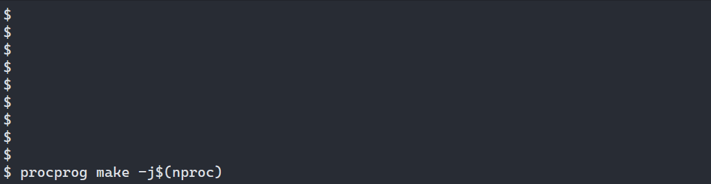

# procprog
A program for monitoring output in a less verbose way

---

### To use include-what-you-used:
- Install iwyu (and clang if you don't already have it) `sudo apt install iwyu clang`
- Make sure iwyu can see the clang library include files for the version of clang you have installed:
    - If the directory given from `include-what-you-use -print-resource-dir` is empty, symbolic link that directory to the one on your system,
e.g. if iwyu wants clang-9, and you have clang-10 installed
    `sudo ln -s /usr/lib/clang/10 /usr/lib/clang/9.0.1`.
- Run `make iwyu`
