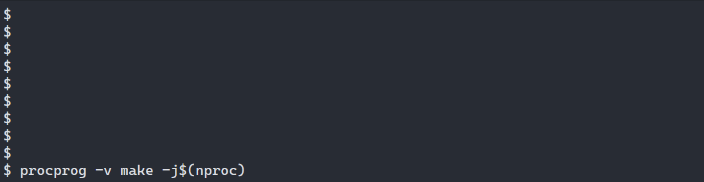
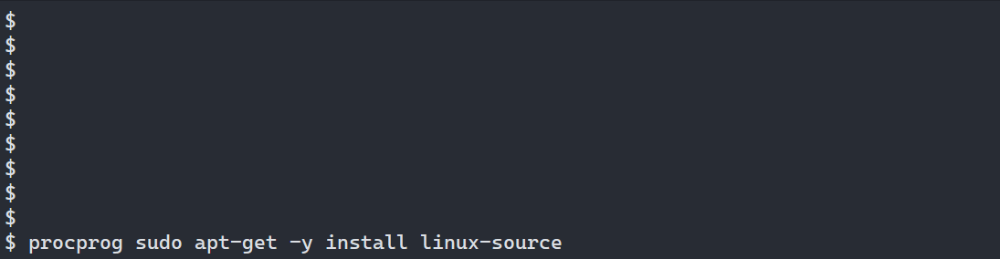

# procprog
A program for monitoring program output and system usage in a single terminal

---

### Demos
#### Compiling ffmpeg with the default, installer-style output:

#### Compiling ffmpeg with the verbose (-v) output, showing all output on-screen:

#### Installing the linux source package with apt-get:


### Installing from PPA
Available in a Launchpad PPA: https://launchpad.net/~frosticles/+archive/ubuntu/procprog, install by doing
```shell
sudo add-apt-repository ppa:frosticles/procprog
sudo apt update  # Not required on ubuntu 18.04 and newer, add-apt-repository should update automatically
sudo apt install procprog
```

### Compiling

No external dependencies are required to compile the executable, although `help2man` will be required if you want to build the manual.

- `make` will compile the executable to the current directory
- `make install` will (compile and) install the executable to `/usr/bin`
- `make manual` will (compile and) generate a manpage from the output of `./procprog --help`

### To use include-what-you-used:
- Install iwyu (and clang if you don't already have it) `sudo apt install iwyu clang`
- Make sure iwyu can see the clang library include files for the version of clang you have installed:
    - If the directory given from `include-what-you-use -print-resource-dir` is empty, symbolic link that directory to the one on your system,
e.g. if iwyu wants clang-9, and you have clang-10 installed
    `sudo ln -s /usr/lib/clang/10 /usr/lib/clang/9.0.1`.
- Run `make iwyu`
